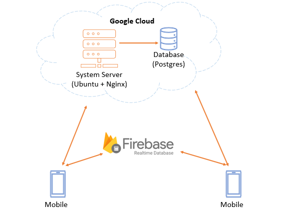

# Sharks
Sharks is an educational app that helps pre-tertiary Ghanaian students to take tailored lessons based on the new curriculum. 
This repository is where I build the sharks app. The web app (`/web`) provides a dashboard through which contents can be added, updated, or deleted. The mobile client version  (`/mobile`) is the mobile app that students will use to access the contents as well.



# Web

## Language and Libraries
- Python 3.8
- Django 3

## Installation
Clone the repository and open it in an editor.
```bash
git clone https://github.com/dodziraynard/sharks.git
```

```bash
cd sharks/web

pip install -r requirements.txt

python .\manage.py makemigrations
python .\manage.py migrate
```
#### Creating an account
- Run the command below to create an administrative account to access the dashboard.
```bash
python .\manage.py createsuperuser 
```

## Running
Run this command to spin up the development server.
```bash
python .\manage.py runserver 0.0.0.0:8000
```
- Finally, open [http://127.0.0.1:8000/](http://127.0.0.1:8000/) in the browser and enter the credentials to login.
- Create some contents and run the mobile app (android) to view them in the app as well.


## Live demo
View the dashboard currently hosted on google cloud [here](http://34.67.115.110)


# Mobile

## Language and Libraries
- Java
- Native Android SDK

## Installation
Clone the repository and open `/mobile` directory in android studio.
```bash
git clone https://github.com/dodziraynard/sharks.git
```

## Running
In order to enable the mobile app connect to the local running instance of the backend, you may want to edit `app/src/main/java/com/innova/sharks/utils/Constants.java`
by changing the IP address in the `TEST_BASE_API_URL` constant.

```java
    ...
    // TESTING BASE API URL
    public static final String TEST_BASE_API_URL = "http://YOUR_LOCAL_TEST_IP:8000/api/v1.0/";
    ...
```
- To test the app using the live backend server, either build the release version of the app or assign `http://34.67.115.110/api/v1.0/` to the `TEST_BASE_API_URL` constant.
- Connect a real device or start the emulator.
- Run the app from android studio.
