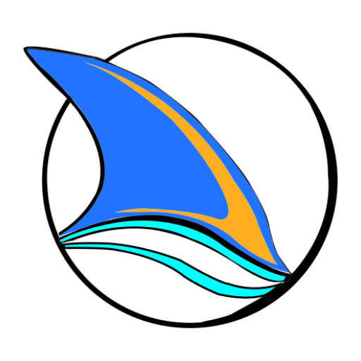

# Sharks
This is the mobile app directory. The mobile app is built using android studio, native Android SDK, and Java programming language.



## Language and Libraries
- Java 9.0
- Native Android SDK

## Installation
Clone the repository and open `/mobile` directory in android studio.
```bash
git clone https://github.com/dodziraynard/sharks.git
```

## Running
In order to enable the mobile app connect to the local running instance of the backend, you may want to edit `app/src/main/java/com/innova/sharks/utils/Constants.java`
by changing the IP address in the `TEST_BASE_API_URL` constant.

```java
    ...
    // TESTING BASE API URL
    public static final String TEST_BASE_API_URL = "http://YOUR_LOCAL_TEST_IP:8000/api/v1.0/";
    ...
```
- To test the app using the live backend server, either build the release version of the app or assign `http://34.67.115.110/api/v1.0/` to the `TEST_BASE_API_URL` constant.
- Connect a real device or start the emulator.
- Run the app from android studio.


[Here](app/release/app-release.apk) is the release built (apk) of the app.